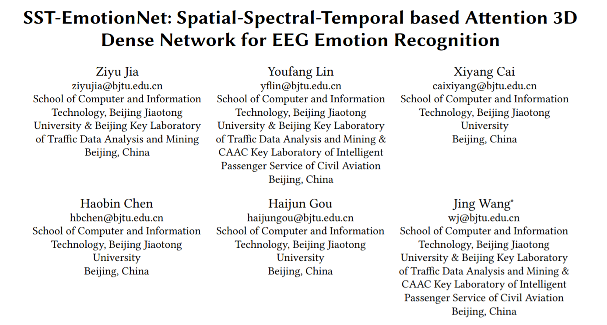
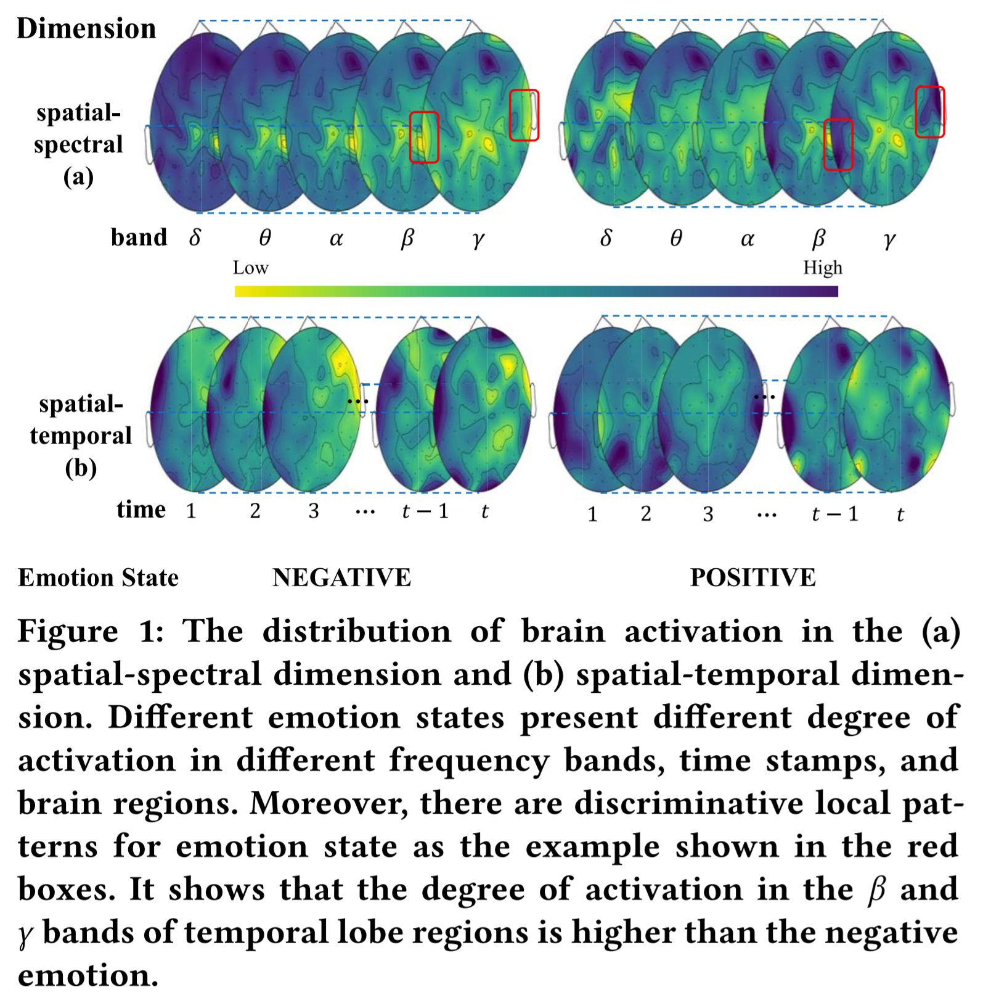
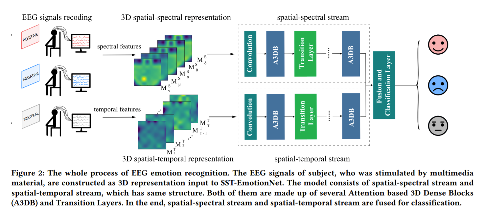
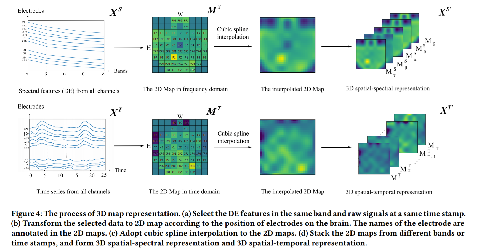
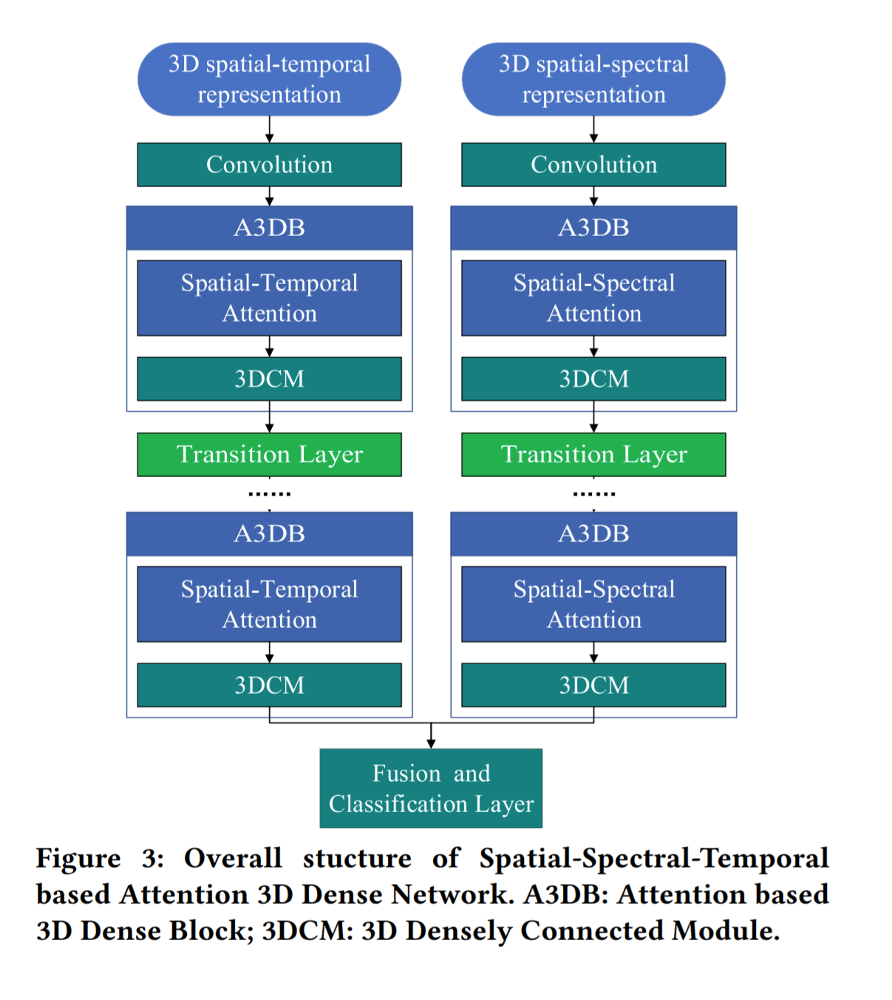
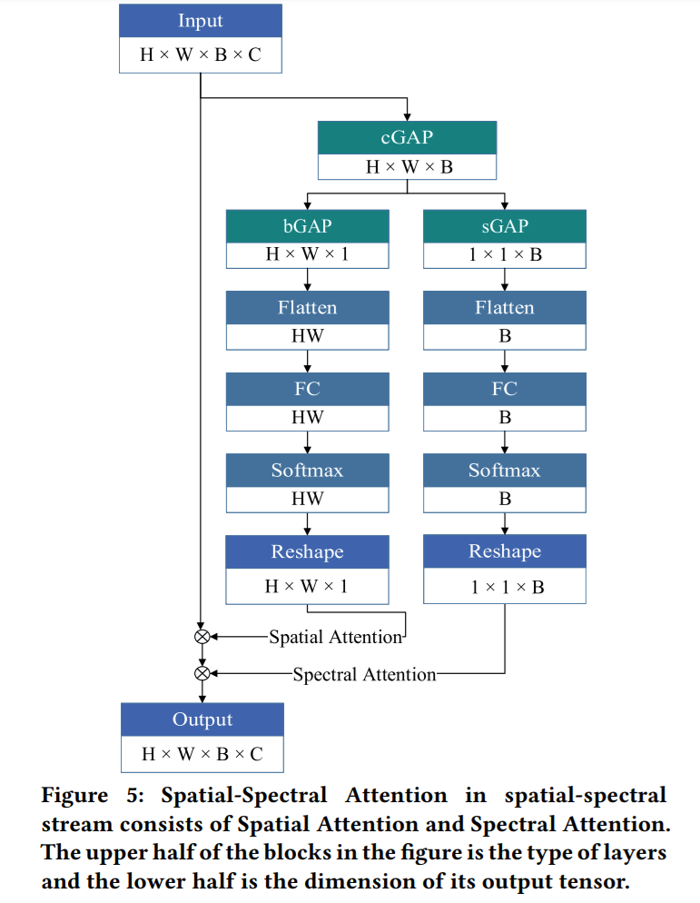
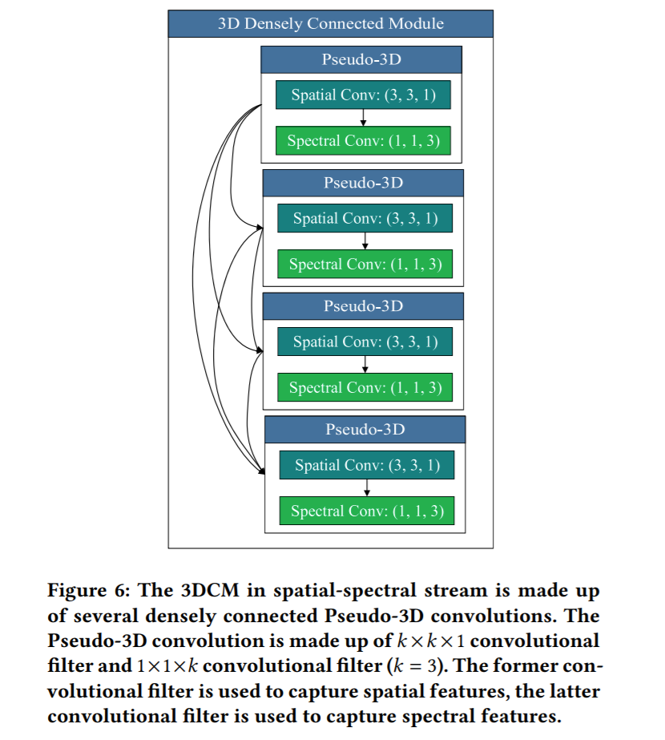
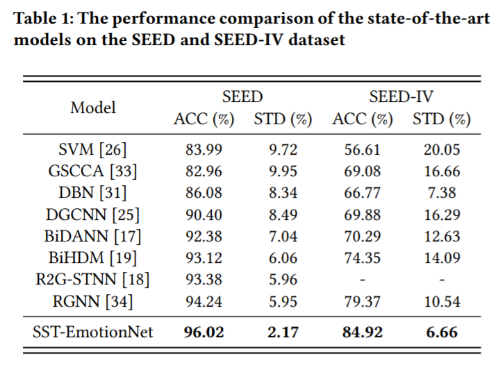
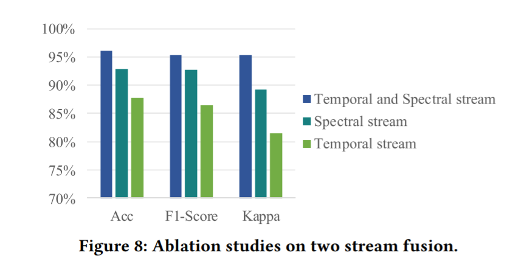
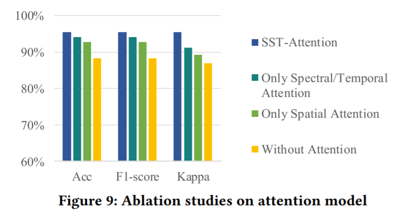

若公式无法正常显示，推荐使用 [GitHub with MathJax](https://chrome.google.com/webstore/detail/github-with-mathjax/ioemnmodlmafdkllaclgeombjnmnbima) 插件，或直接阅读 [HTML版](https://ziyujia.github.io/Chinese-Reading-Materials/Materials/SST-EmotionNet/SST-EmotionNet.html) / [PDF版](SST-EmotionNet.pdf)

---

## [ACM MM 2020] 一种基于情感脑电信号时-频-空特征的3D密集连接网络

本文介绍一篇于计算机领域顶级会议ACM MM 2020发表的论文《SST-EmotionNet: Spatial-Spectral-Temporal based Attention 3D Dense Network for EEG Emotion Recognition》，该研究提出了一种基于注意力机制的3D DenseNet对多媒体刺激产生的情感脑电信号进行分类，该模型在统一的框架下同时提取数据中的空间、频率、时间特征；并且设计了一种3D注意机制来自适应地探索具有判别力的局部模式提升情绪分类效果，在现有的多个数据集上分类表现均为最优。该文提出的模型是一个多变量脑电信号的通用框架，可以被拓展到其余信号分类任务中。

**论文链接：**

https://dl.acm.org/doi/abs/10.1145/3394171.3413724

**论文代码链接：**

https://github.com/ziyujia/SST-EmotionNet

## 1. 背景简介

情绪会影响人类的行为，且在日常生活中发挥着重要作用。许多精神疾病与情绪有关，例如自闭症和抑郁症。 因此，情绪常被用作评估患者精神障碍的参考。 越来越多的研究人员专注于针对特定刺激模式引起的不同情绪的脑电图分析。 研究主要集中在使用多媒体材料（包括图像，声音，文本等）设计实验来刺激大脑并暴露其认知活动以进行情感分类。

## 2. 动机

### 2.1 挑战

**2.1.1 挖掘脑电信号时-频-空特征的互补性。**

现存的脑电情绪模型大多仅单独使用了脑电信号的时域、频域、空域信息或是以上两种特征的组合。这些模型忽略了脑电信号时-频-空特征之间的互补性，会在一定程度上限制脑电分类模型的性能表现。如何利用脑电信号中时-频-空特征之间的互补性，这是一个挑战。

**2.1.2 捕获时-频-空特征之间的局部特征。**

脑电信号的局部时-频-空特征中会存在一些反映大脑情绪的局部特征。如图中的红框所示，受试者处于积极情绪时，大脑颞叶在$\gamma$频段下的激活程度会比消极时更高。这些局部特征的存在有助于情绪的识别。因此，如何捕获情绪识别任务中脑电信号的局部时-频-空特征是另一个挑战。

### **2.2 贡献**

1. 基于构建的脑电的时-频-空特征，我们提出了一种双流3D密集连接网络，在统一的网络框架下融合了脑电信号的时-频-空特征。
2. 我们设计了一种并行的时-频-空注意力机制，用于动态捕获在不同脑区、频段、时间之间的局部判别特征。
3. 在基准数据集的实验结果表明，提出的SST-EmotionNet优于传统的基线方法，取得了SOTA的性能。

## 3. 数据表示与问题定义

脑电信号的3D表示的过程如图。具体而言，在本研究中，定义 $ \mathbf{X}^T = (\mathbf{S}^T_1,\mathbf{S}^T_2,\dots,\mathbf{S}^T_{T})\in\mathbb{R}^{E\times T} $ 为长为$T$个时间点的$E$个EEG电极的数据。其中，$\mathbf{S}^T_t = (s_t^1,s_t^2,\dots,s_t^E)\in\mathbb{R}^{E} (t\in \{ 1, 2 \dots, T\})$为在时间点$t$时所有电极的数据。利用各个电极的空间位置信息，我们$\mathbf{S}^T_t$ 将变换成2D时间平面图$\mathbf{M}^T_t\in\mathbb{R}^{H\times W}$, $H$和 $W$分别为2D平面图的高与宽。将所有时间点下形成的$T$个2D平面图堆叠起来，我们能够得到信号的3D时空表示$\mathbf{X}^{T'} = (\mathbf{M}^T_1,\mathbf{M}^T_2,\dots, \mathbf{M}^T_{T})\in\mathbb{R}^{H\times W\times T}$。

我们定义$\mathbf{X}^S = (\mathbf{S}^S_1,\mathbf{S}^S_2,\dots,\mathbf{S}^S_{B})\in\mathbb{R}^{E\times B}$为包含了$B$个频段的EEG信号的频域特征。其中，$\mathbf{S}^S_b = (s_b^1,s_b^2,\dots,s_b^E)\in\mathbb{R}^{B} (b\in \{ 1, 2 \dots, B\})$ 为在频段$b$下的所有电极的数据。与时域同理，$\mathbf{S}^S_b$会被变换成2D频域平面图$\mathbf{M}^S_b\in\mathbb{R}^{H\times W}$。将所有频段下形成的$B$个2D平面图堆叠起来，我们能够得到信号的3D频空表示$\mathbf{X}^{S'} = (\mathbf{M}^S_1,\mathbf{M}^S_2,\dots, \mathbf{M}^S_{B})\in\mathbb{R}^{H\times W\times B}$ 。此处，我们使用5了个频段的EEG频域特征，即$b\in \{\delta, \theta, \alpha, \beta, \gamma\}$。

EEG情绪识别问题被定义如下，模型需要学习一个映射函数$F$，将输入映射到对应的情绪标签：
$$
Y{classification}=F(\mathbf{X}^{T'}, \mathbf{X}^{S'})
$$

此处$F$表示映射函数， $Y_{classification}$表示情绪的分类标签。

## 4. Spatial-Spectral-Temporal based Attention 3D Dense Network

SST-EmotionNet的总体架构如图所示。我们总结了本文模型的四大关键点：

1. 基于构建的脑电3D时-频-空特征，在一个统一的网络框架下融合了脑电信号的时-频-空特征。
2. 提出了一种并行的空-频/时注意力机制，用于动态捕获在不同脑区、频段、时间中的局部判别特征。
3. 设计了3D密集连接模块和过渡层帮助特征重用，加强特征传播过程，以达到更高的模型效率。
4. 使用伪3D模块提高3D卷积的内存效率与计算效率。

### 4.1 空-频/时注意力机制

脑电信号在不同情绪状态下的时-频-空特征激活中且存在一些有判别力的局部特征。我们设计了一种空-频/时注意力机制（SST-Attention）用于动态捕获这些有价值的局部特征。SST-Attention由两个子组件构成：空间注意力机制与频段/时间注意力机制。

由于空-频注意力机制与空-时注意力机制在结构上较为相似，此处我们将以空-频注意力机制为例进行展示。空-频注意力机制组件的结构如图所示。首先，跨通道的全局池化（channel-wise global average pooling, cGAP）被用于减少计算成本，它被定义如下：
$$
\mathbf{M}^{avg}_{h, w, b} = \mathbf{F}_{\mathbf{cGAP}}(\mathbf{X}_{h,w,b}) = \frac{1}{C}\sum_{c=1}^{C}\mathbf{X}_{h,w,b}(c)
$$
其中，$\mathbf{X}\in\mathbb{R}^{H\times W\times B\times C}$ 在通道维度$C$上退化可得到$\mathbf{M}^{avg}\in\mathbb{R}^{H\times W\times B}$； $\mathbf{F}_{\mathbf{cGAP}}$表示cGAP函数；$\mathbf{X}_{h,w,b}$表示在张量$\mathbf{X}$的$h, w, b$处的跨通道数据向量。

#### 4.1.1 空间注意力机制

空间注意力机制用于动态关注空间上对情绪识别任务有价值的大脑区域。最开始，跨频段全局池化（band-wise global average pooling, bGAP）将用于退化频段维度，其过程定义如下：
$$
\mathbf{M}^{spa}_{h, w} = \mathbf{F}_{\mathbf{bGAP}}(\mathbf{M}^{avg}_{h,w})=\frac{1}{B}\sum_{b=1}^{B}\mathbf{M}^{avg}_{h,w}(b)
$$
其中$\mathbf{M}^{spa}\in\mathbb{R}^{H\times W \times 1}$表示频域特征在空间上的分布情况，它由$\mathbf{M}^{avg}\in\mathbb{R}^{H\times W\times B}$退化频段维度$B$得到；$\mathbf{F}_{\mathbf{bGAP}}$表示bGAP函数; $\mathbf{M}^{avg}_{h,w}$ 表示一个在张量$\mathbf{M}^{avg}$的$h, w$处的一个包含着跨频段数据的向量。

随后，空间注意力矩阵将由一个带有$softmax$激活的全连接层得到：
$$
\mathbf{A}_{spa}=softmax(\mathbf{W}\mathbf{M}^{spa}+\mathbf{b})
$$
其中$\mathbf{W}$ 和$\mathbf{b}$为可学习的参数；$\mathbf{A}_{\mathbf{spa}}\in\mathbb{R}^{H\times W\times1}$ 为归一化后的2D空间注意力矩阵。

#### 4.1.2 频/时注意力机制

为了动态捕获不同频带、时间点中对情绪识别有辨识度的特征，我们设计了频/时注意力。以频域注意力机制为例，我们首先对输入的张量作空间全局池化（spatial-wise global average pooling, sGAP）用于退化空间维度，其过程定义如下：
$$
\mathbf{M}^{spe}_{b} = \mathbf{F}_{\mathbf{sGAP}}(\mathbf{M}^{avg}_{b})=\frac{1}{H\times W}\sum_{h=1}^{H}\sum_{w=1}^{W}\mathbf{M}^{avg}_{b}(h,w)
$$
其中，$\mathbf{M}^{spe}\in\mathbb{R}^{1 \times 1 \times B}$表示频域特征在不同频带上的分布情况，它由$\mathbf{M}^{avg}\in\mathbb{R}^{H\times W\times B}$退化空间维度$H, W$得到；$\mathbf{F}_{\mathbf{sGAP}}$表示sGAP函数；$\mathbf{M}^{avg}_{b}$表示$\mathbf{M}^{avg}$上第$b$个频带上对应的平面。

而后，频域注意力矩阵将由一个带有$softmax$激活的全连接层得到：
$$
\mathbf{A}_{spe}=softmax(\mathbf{W}^\prime\mathbf{M}^{spe}+\mathbf{b}^\prime)
$$
其中$\mathbf{W}^\prime$ 和$\mathbf{b}^\prime$为可学习参数； $\mathbf{A}_{spe}\in\mathbb{R}^{1\times1\times B}$为归一化后的频域注意力矩阵。

在得到了空间注意力矩阵$\mathbf{A}_{spa}\in\mathbb{R}^{H\times W\times1}$与频域注意力矩阵$\mathbf{A}_{spe}\in\mathbb{R}^{1\times1\times B}$以后，频-空注意力机制被定义如下：
$$
\mathbf{X}^\prime=\mathbf{A}_{spa}\otimes\mathbf{X}\\

\mathbf{X}^{\prime\prime}=\mathbf{A}_{spe}\otimes\mathbf{X}^\prime
$$
其中$\otimes$代表逐元素相乘操作。在乘积操作过程中，频域注意力与空间注意力的数值将会分别沿着空间维度与频域维度被广播。$\mathbf{X}^{\prime\prime}$为空-频/时注意力机制的输出张量。

### 4.2 3D密集连接模块

为了加强特征传播、达到更好的参数效率，受到2D DenseNet的启发，我们设计了一种3D密集连接模块（3D Densely Connected Module, 3DCM）。每个3DCM由若干个密集连接的伪3D卷积组成。频-空流中的3DCM结构如图所示。

**密集连接**： 3DCM中采用了密集连接机制。对于该模块内的第$l$层，它将前序的所有层的特征图作为输入：
$$
\mathbf{X}_l=H_l\left(\left[\mathbf{X}_0,\mathbf{X}_1,\ldots,\mathbf{X}_{l-1}\right]\right)
$$
其中$[\mathbf{X}_0,\mathbf{X}_1,\ldots,\mathbf{X}_{l-1}]$表示$\mathbf{X}_0,\mathbf{X}_1,\ldots,\mathbf{X}_{l-1}$进行拼接; $H_l$ 表示每层内进行的伪3D卷积。

**伪3D卷积：**传统的3D卷积核为$k\times k\times d$，其中$k$为卷积核在空间维度的边长、$d$为频/空维度的长度，而传统3D卷积的计算开销较大。为了减少计算开销，伪3D卷积将传统的$k\times k\times d$的3D卷积核分解为了等价于空域上2D卷积的$k\times k\times1$卷积核的与时/频域上的1D卷积的$1 \times 1 \times d$卷积核。为了加快计算速度，我们在3DCM中使用伪3D卷积代替了传统的3D卷积操作。这样一来，前面的$H_l$可被定义为：
$$
H_l(\mathbf{X})=f^{1\times1\times d}(f^{k\times k\times1}(\mathbf{X}))
$$
其中$\mathbf{X}$表示伪3D卷积模块的输入； $f^{k\times k\times1}$表示捕获空间特征的2D卷积；$f^{1\times1\times d}$表示捕获频域或时域EEG特征的1D卷积。 

### 4.3 过渡层

为了提高模型的紧凑性，我们采用了DenseNet的一个重要组成部分——过渡层。过渡层通过减少特征图的数量使模型变得紧凑。过渡层由一个Batch Normalization层、一个$1 \times 1$的卷积层、一个$2\times2$的平均池化层构成。$1\times 1$的卷积层被用于减少特征图的数量，平均池化层用来减小特征图的大小。若一个3DCM包含$m$个特征图，则跟随它的过渡层将会输出$\lfloor \theta m \rfloor$个特征图，其中 $\theta \in (0, 1]$被称为压缩率。

### 4.4 融合分类层

SST-EmotionNet从频空流中提取脑电信号的频空特征，并从时空流中提取脑电信号的时空特征。频空流和时空流的输出被融合层所融合，从而进行高精度分类。 融合层由连接层和具有$softmax$激活的完全连接层组成。 

## 5. 实验

### 5.1 数据集

我们在SEED（SJTU Emotion EEG Dataset）与SEED-IV数据集上评估了我们提出的模型。SEED数据集包含来自15名受试者在3个时间段内观看的15个能够诱发3种情绪电影片段的EEG记录；SEED-IV数据集则包含来自15名受试者在3个时间段内观看的15个能够诱发4种情绪电影片段的EEG记录。EEG信号在5个频带下的差分熵特征（differential entropy, DE）被提取作为输入的频域特征。

### 5.2 结果

我们与8种Baseline方法进行了比较，结果如表2所示：

SST-EmotionNet在两个数据集上均取得了优于所有基线方法的性能。我们推测模型分类性能提升原因有以下几点：

1. 不同于现有的方法，SST-EmotionNet同时捕获脑电信号的空间、频率、时间特征，并利用了各种特征之间的互补性进行情绪分类。

2. 空-频/时注意力机制的引入使模型更专注于对情绪识别有辨识力的时-频-空局部模式的识别，提升了分类表现。

### 5.3 消融实验

为了进一步验证我们模型各个组件的有效性，我们设计了一系列消融实验。

**双流消融：**我们首先将双流的模型结构消融成了单流的模型结构，实验结果如图所示：

在使用双流模型的情况下，模型的准确率能够比单独使用时-空、频-空流的模型分别高出9.48%与3.51%。该结果表明利用不同特征之间的互补性能够有效提高分类准确率。

**注意力机制消融：**我们对SST-Attention的两个子组件分别进行了消融，实验结果如图所示：

在消融各个注意力机制时，各类评价指标均有下降。如仅使用时/频注意力机制的模型比原模型的分类准确率下降了1.94%，仅使用空间注意力机制的模型则下降了3.30%。该实验结果表明了SST-Attention模块能够捕获有价值的局部特征从而提高模型的分类性能。

## 6. 结论

本文提出了一种脑电情绪识别模型SST-EmotionNet，该模型使用双流的结构同时捕获脑电信号具有互补性的空间、频率、时间三类特征；同时，设计了一种空-频/时注意力机制，使该模型能够动态关注一些对情绪识别任务较有辨识度的时-频-空局部模式。在公开的脑电情绪识别数据集SEED与SEED-IV上的实验表明，该模型有着出色的性能优于传统的基线方法。此外，该文提出的模型是一个多变量生理时间序列的通用框架，未来可以应用于睡眠分期、疲劳驾驶监测等相关领域中。